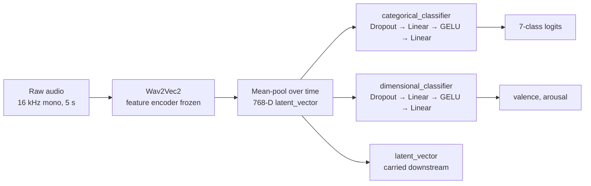
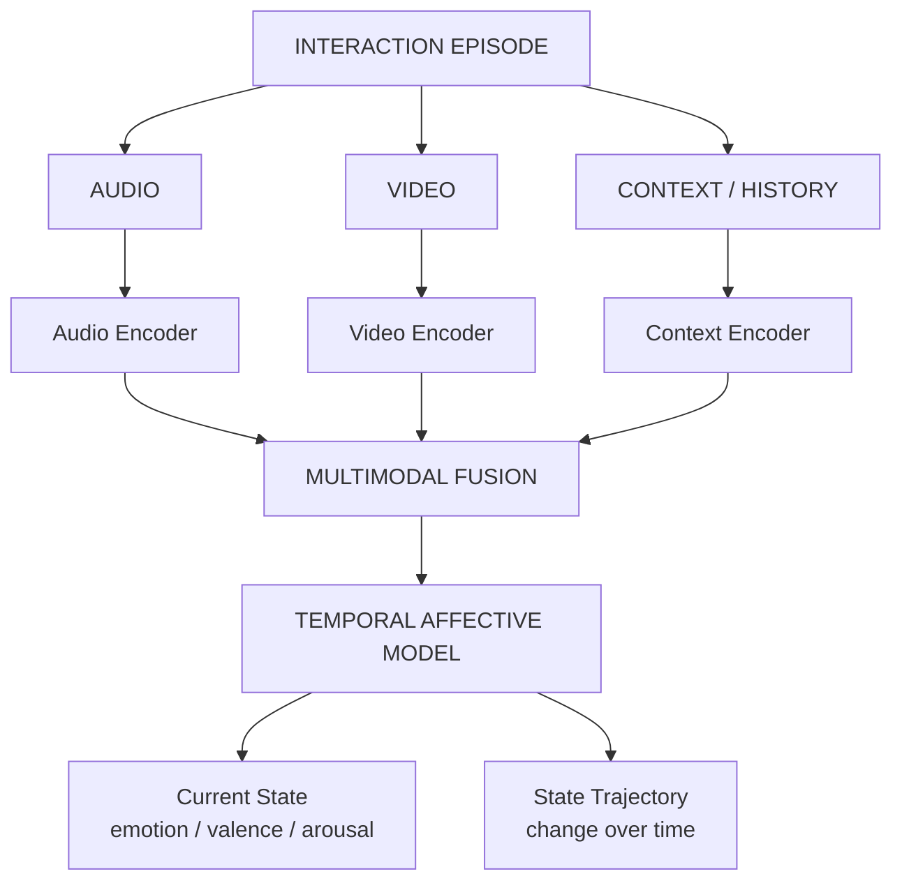
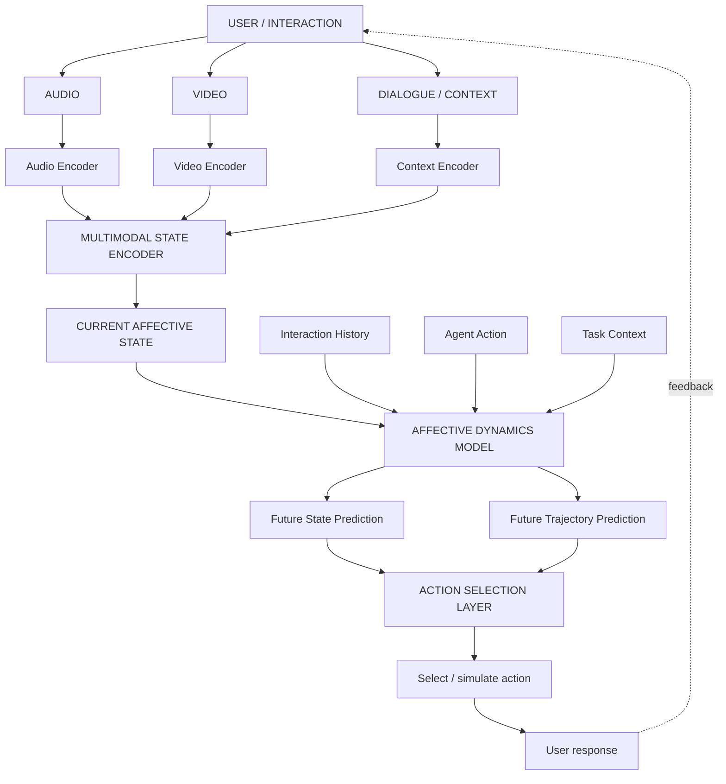

# Multimodal Affective State Prediction

**Affective Dynamics and Predictive Human–Robot Interaction** — multimodal modeling of human affective state *transitions* for adaptive AI and consumer robotics.

> We are moving beyond conventional emotion recognition, where a model predicts an emotion from an isolated clip, frame, or utterance. This project is treating human affect as a **dynamic process** that evolves over time and is shaped by interaction context.

```
Emotion Recognition → Affective State Tracking → Affective Dynamics → Future-State Prediction → Adaptive Interaction
```

This repository is the working codebase for a two-stage B.Tech research program (Minor → Major → publication). Development is currently active and the structure is expected to keep changing as experiments land.

---

## 1. What this project is asking

Conventional affective computing takes a **static view**:

```
observation → emotion label
```

We are pursuing a **dynamic view**:

```
multimodal observations + history + context → affective state → trajectory → future state
```

The governing research question:

> **How can a multimodal learning system model, track, and predict human affective state transitions during interactive tasks?**

| Research level | Question being asked | Contribution |
|---|---|---|
| Conventional emotion recognition | What emotion is expressed now? | Static classification / regression |
| **Minor** | How is affect *changing* over time? | Temporal multimodal affective-state tracking |
| **Major** | How will affect change *after an agent action*? | Action-conditioned future-state prediction |
| Long-term extension | Which action produces a *better* affective trajectory? | Adaptive interaction / policy selection |

### Positioning against existing work

We are not claiming that temporal emotion recognition is itself unexplored — recent multimodal conversational-emotion work already models temporal affective dynamics and cross-modal interaction. The sharper gap we are pursuing is **linking affective trajectory modeling to interaction context, and — in the Major — conditioning prediction on agent actions** so that predicted affect can inform how an agent behaves.

---

## 2. Current status

We are currently at the **encoder-consolidation stage**: the modality-specific encoders exist and run, and we are now assembling them into a single temporally-aware pipeline.

| Component | State | Notes |
|---|---|---|
| Audio encoder (AER) | **Working** | Wav2Vec2-based, multi-task, emits a 768-D latent vector |
| Visual encoder (VER) | **Working** | VLM-based real-time group/visual emotion recognition |
| Unified multimodal alignment | *In progress* | We are defining the shared affective representation and time base |
| Temporal affective model | *Next up* | The Minor's core contribution |
| Context / history encoder | *Planned* | |
| Action-conditioned predictor | *Planned* | The Major's core contribution |
| Adaptive action-selection layer | *Planned* | |

Right now we are focusing on normalizing the two encoders onto a **common affective representation** (7-class categorical + continuous valence/arousal) and a **common time base**, so that temporally ordered interaction windows can be constructed rather than treating every observation as independent.

---

## 3. Repository layout

```
multimodal-affective-state-prediction/
├── AER/                         Audio Emotion Recognition encoder
│   ├── src/
│   │   ├── config/config.py         Central config (model, audio, training, paths)
│   │   ├── models/affective_encoder.py   Wav2Vec2 + multi-task heads
│   │   └── data/dataset.py          Resampling, mono-conversion, pad/truncate
│   ├── scripts/
│   │   ├── preprocess_datasets.py   RAVDESS/TESS/CREMA-D/SAVEE → unified manifest
│   │   ├── process_cultural_audio.py  Culturally-situated audio + label mapping
│   │   ├── train.py                 Multi-loss training loop
│   │   ├── evaluate.py              Held-out metrics
│   │   └── inference.py             Single-clip JSON payload + latent vector
│   ├── requirements.txt
│   └── README.md                    Detailed per-file AER walkthrough
│
└── VER/                         Visual Emotion Recognition encoder
    ├── real-time-emo-paligemma2.py       Real-time webcam VLM emotion loop
    ├── music4D-real-time-emo-*.py        MiniCPM-V / Qwen2-VL / PaliGemma / Moondream variants
    ├── Music4D-demo-GER*.py              Multi-source group-emotion demos + Flask dashboards
    ├── extract_inference.py              Inference log + video → aligned dataset
    ├── extract_label.py                  Label-conditioned frame extraction
    └── LLaVA_Holistic_GER.ipynb          Holistic group-emotion-recognition notebook
```

---

## 4. What exists today

### 4.1 AER — Audio Emotion Recognition encoder

`AffectiveEncoder` wraps `facebook/wav2vec2-base` and splits its representation into two task-specific heads while exposing the pooled representation itself.



- **Backbone:** `facebook/wav2vec2-base`, with the convolutional feature encoder **frozen** so the model's low-level acoustic understanding is protected during fine-tuning.
- **Audio contract:** everything is resampled to **16 kHz**, averaged to **mono**, and padded/truncated to **5 seconds**.
- **Taxonomy:** a unified 7-class layout — `0 Neutral, 1 Happy, 2 Sad, 3 Angry, 4 Fear, 5 Surprise, 6 Disgust`.
- **Multi-task objective:** `CrossEntropyLoss` on the categorical head plus `MSELoss` on valence/arousal, combined into a single backpropagated loss.
- **Training defaults:** `batch_size=8`, `learning_rate=2e-5` (deliberately scaled down — `1e-4` induces catastrophic forgetting in the pre-trained transformer), `epochs=10`.
- **Key output:** alongside the labels, `forward()` returns the **768-D `latent_vector`**. This is the payload that matters for this project — it is the per-window affective representation that the temporal model is being built on top of.

`preprocess_datasets.py` normalizes RAVDESS, TESS, CREMA-D and SAVEE — each of which labels files differently — down to the unified `0–6` taxonomy, attaches approximate valence/arousal coordinates per class, and emits a `train_manifest.csv` plus a `class_distribution.png` balance chart.

`process_cultural_audio.py` extends the pipeline to culturally-situated conversational audio, resolving mixed annotation labels (`Joy+Surprise`, `Sadness+Anger`, …) into the same 7-class taxonomy by primary dominance.

**Trained weights.** A `cultural_mixed` run trained to epoch 9 exists (`aer_cultural_mixed_epoch_9.pt`, ~382 MB) but is **not tracked in this repository** — it exceeds GitHub's 100 MB per-file limit. It is kept out-of-band; see [Obtaining the checkpoint](#7-obtaining-the-trained-checkpoint).

### 4.2 VER — Visual Emotion Recognition encoder

VER takes a different approach from AER: rather than fine-tuning a classifier, it is **prompting vision-language models** to read emotion off live video, which makes it easy to swap backbones and to operate on group scenes rather than single faces.

- **Backbones being compared:** PaliGemma 2, MiniCPM-V, Qwen2-VL, LLaVA, and Moondream.
- **Emotion vocabulary:** `joy, anger, fear, disgust, surprise, sadness, boredom, neutral` — constrained directly in the prompt so outputs stay parseable.
- **Real-time design:** frame capture and model inference run on **separate threads** behind a lock, so a slow VLM forward pass never stalls the video stream.
- **Group Emotion Recognition (GER):** the `Music4D-demo-GER*` scripts ingest **multiple simultaneous camera sources** (director / orchestra / audience), run per-source emotion inference, and composite a live Flask-served dashboard with per-source emotion telemetry.
- **Dataset tooling:** `extract_inference.py` and `extract_label.py` join timestamped inference logs back onto the recorded video to cut out labelled frames — turning live sessions into supervised datasets.

Sample multi-source footage is included under `VER/Video/` so the demos are runnable without a capture rig.

---

## 5. Where this is going

### 5.1 Minor project — *Affective State Tracking*

**Title:** Affective State Tracking: Multimodal Modeling of Human Emotional State Transitions During Interaction

We are building a **temporal multimodal affective-state tracker** that uses audio and visual information — together with interaction history where available — to estimate the user's current affective state and represent how that state evolves across an interaction episode.



Research questions we are testing:

- **RQ1** — Does temporal multimodal modeling improve affective-state prediction over independent frame/utterance-level recognition?
- **RQ2** — Does recent interaction history improve estimation of the user's *current* state?
- **RQ3** — Can the system reliably identify affective *transitions* rather than only static categories?
- **RQ4** — How does the contribution of audio vs. visual modality shift across interaction conditions?

Transitions of interest: `engagement → frustration`, `frustration → recovery`, `engagement → disengagement`.

### 5.2 Major project — *Predictive Affective Modeling*

**Title:** Predictive Affective Modeling for Adaptive Human–Robot Interaction

The Major extends tracking into **prediction**. The hypothesis is that future affective state depends not only on current state, but on interaction history, context, and **the action the agent takes**.

```
current affective state + context + agent action → predicted future affective state / trajectory
```



Research questions:

- **RQ1** — Can multimodal temporal models predict *future* affective states better than current-state-only models?
- **RQ2** — Does interaction context and recent agent/user history improve future-state prediction?
- **RQ3** — Can agent actions be incorporated explicitly as variables influencing predicted transitions?
- **RQ4** — Can predicted trajectories support selection between alternative interaction strategies?
- **RQ5** — Under what conditions does the model fail, and how robust is it across users and scenarios?

### 5.3 Optional extension — counterfactual affective modeling

If the predictive model performs well enough, we would extend to asking: *had the agent acted differently, how might the trajectory have changed?* — comparing candidates such as *repeat the explanation*, *change strategy*, or *ask a diagnostic question first*.

This is explicitly gated behind a working predictive model, and we are **not** treating it as causal inference unless the study design supports that claim.

### 5.4 General ML formulation

For a venue where the contribution should read as a learning formulation rather than an application:

```
z_t       = Encoder(X_1:t, C_1:t)
z_{t+1}   = F(z_t, a_t, c_t)
ŷ_{t+1:t+k} = Decoder(z_{t+1})
```

where `z` is a latent affective state, `X` multimodal observations, `C` context/history, and `a` an agent action.

---

## 6. Experimental plan

| # | Experiment | Input | Temporal | Context | Purpose |
|---|---|---|---|---|---|
| E1 | Audio baseline | Audio | ✗ | ✗ | Unimodal reference (**AER, exists**) |
| E2 | Video baseline | Video | ✗ | ✗ | Unimodal reference (**VER, exists**) |
| E3 | Static multimodal | A + V | ✗ | ✗ | Fusion reference |
| E4 | Temporal multimodal | A + V | ✓ | ✗ | **Minor core** |
| E5 | Context-aware temporal | A + V + history | ✓ | ✓ | Test contextual gain |
| E6 | Future-state prediction | Multimodal + history | ✓ | ✓ | **Major core** |
| E7 | Action-conditioned prediction | State + context + action | ✓ | ✓ | **Major core** |
| E8 | Counterfactual actions | State + context + candidates | ✓ | ✓ | Optional extension |

### Evaluation

| Task | Metrics |
|---|---|
| Categorical emotion | Macro-F1, weighted-F1, balanced accuracy, confusion matrix |
| Valence/arousal regression | MAE, RMSE, CCC |
| State-transition prediction | Macro-F1, transition accuracy, per-transition recall |
| Trajectory prediction | MAE/RMSE over horizon, temporal correlation, trajectory similarity |
| Ablation | Δ after removing modality / history / context |

Evaluation is being run **speaker-independent / participant-independent** wherever the dataset permits.

### Data strategy

We are prioritizing established affective-computing datasets over collecting new data:

- **IEMOCAP** — multimodal conversational emotion (audio, visual, text); the main vehicle for temporal and conversational affect.
- **CMU-MOSEI** — large-scale multimodal sentiment/emotion for continuous affect experiments.
- **MELD** — multimodal emotion recognition in conversations with dialogue structure.
- **RAVDESS / TESS / CREMA-D / SAVEE** — already wired into the AER preprocessing pipeline as acted-speech baselines.

A task-specific HRI dataset with explicit robot/action annotations may be added later if action-conditioned experiments require it. Any participant study would require institutional approval, informed consent, anonymization and responsible data handling.

---

## 7. Getting started

### AER

```bash
cd AER
python -m venv .venv && source .venv/bin/activate
pip install -r requirements.txt

# 1. Place datasets under AER/data/raw/generic/{ravdess,tess,crema,SAVEE}
# 2. Build the unified manifest + class-distribution chart
python scripts/preprocess_datasets.py

# 3. Train
python scripts/train.py

# 4. Evaluate on held-out data
python scripts/evaluate.py

# 5. Single-clip inference → JSON payload with latent vector
python scripts/inference.py path/to/audio.wav
```

`inference.py` also exposes `run_aer_inference(model, target_audio)` as a module-level function so it can be called directly from an external router (e.g. a Flask service) rather than through the CLI.

Device selection is automatic — CUDA if present, else Apple MPS, else CPU.

### VER

The VER scripts each pull their own VLM. A local snapshot path is expected at `../paligemma_offline` for the offline PaliGemma demos; the other variants download from Hugging Face on first run (some gated models require `huggingface_hub.login()`).

```bash
# Real-time single-camera emotion loop
python VER/real-time-emo-paligemma2.py

# Multi-source group-emotion dashboard (serves on :5000)
python VER/Music4D-demo-GER-dash-emo-telemetry.py
```

### Obtaining the trained checkpoint

`aer_cultural_mixed_epoch_9.pt` (~382 MB) is not in git. Either:

- **retrain** — `python AER/scripts/train.py` reproduces it from the manifest, or
- **request the artifact** — it is held outside the repository; open an issue if you need it.

If you have the file, drop it at `AER/aer_cultural_mixed_epoch_9.pt`. Note that `scripts/inference.py` currently looks for `aer_base_model_epoch_9.pt` by default and warns (rather than fails) when weights are missing — it will happily run an untrained base model, so check that warning line before trusting any output.

---

## 8. Scope control and honest limitations

These constraints are deliberate and we are holding to them:

- **No physical robot.** A simulated or software agent is sufficient for the research objective; we are not building hardware.
- **Counterfactual ≠ causal.** We will not present counterfactual action modeling as causal inference without a study design that supports it.
- **Psychological constructs used carefully.** Terms like *frustration*, *engagement* and *stress* are only used where the dataset annotations or study design actually support them.
- **Labels are not internal states.** Emotion labels are not direct measurements of a person's internal psychological experience. This system estimates *observable and annotated* affective state.
- **The Minor stays on tracking.** Predictive action selection is reserved for the Major.
- **Reproducibility over leaderboard scores.** We are prioritizing speaker-independent evaluation, reported uncertainty and honest failure analysis over maximizing a single benchmark number.

A known caveat in the current AER pipeline: valence/arousal targets in `preprocess_datasets.py` are **approximated per class** rather than continuously annotated. Any dimensional result from the acted-speech datasets should be read as a proxy, and continuous-annotation corpora are needed before making claims about valence/arousal regression quality.

---

## 9. Publication pathway

| Stage | Working title | Contribution | Target |
|---|---|---|---|
| Minor / Conference | Modeling Affective State Transitions from Multimodal Interaction Signals | Temporal multimodal affective-state tracking | Affective computing / HRI / AI venue |
| Major / Journal | Predictive Affective Modeling for Adaptive Human–Robot Interaction | Action-conditioned future-state prediction + adaptive interaction | IEEE consumer technology / human-machine systems |
| High-risk extension | Learning Human Affective Dynamics from Multimodal Interaction Histories | General ML formulation of affective dynamics | Top-tier ML venue |

---

## 10. Selected references

1. Picard, R. W. (1997). *Affective Computing.* MIT Press.
2. Busso, C., et al. (2008). IEMOCAP: Interactive emotional dyadic motion capture database. *Language Resources and Evaluation*, 42, 335–359.
3. Zadeh, A., Liang, P. P., Poria, S., Cambria, E., & Morency, L.-P. (2018). Multimodal Language Analysis in the Wild: CMU-MOSEI Dataset and Interpretable Dynamic Fusion Graph. *ACL 2018.*
4. Poria, S., et al. (2019). MELD: A Multimodal Multi-Party Dataset for Emotion Recognition in Conversations. *ACL 2019.*
5. Kulić, D., & Croft, E. A. (2007). Affective State Estimation for Human–Robot Interaction. *IEEE Transactions on Robotics*, 23(5), 991–1000.
6. Kuppens, P., & Verduyn, P. (2017). Emotion dynamics. *Current Opinion in Psychology*, 17, 22–26.
7. Mohamed, Y., Lemaignan, S., Guneysu, A., Jensfelt, P., & Smith, C. (2024). Fusion in Context: A Multimodal Approach to Affective State Recognition. *arXiv:2409.11906.*
8. Zou, J., et al. (2026). Context-fused emotional flow modeling for dynamic affective recognition in dialogue interactions. *Expert Systems with Applications.*
9. T., S., Prakash, J., Vijay, A. A., & Mahendhiran, P. D. (2026). A multimodal transformer system for continuous Valence-Arousal trajectory modeling and emotion forecasting. *Expert Systems with Applications.*
